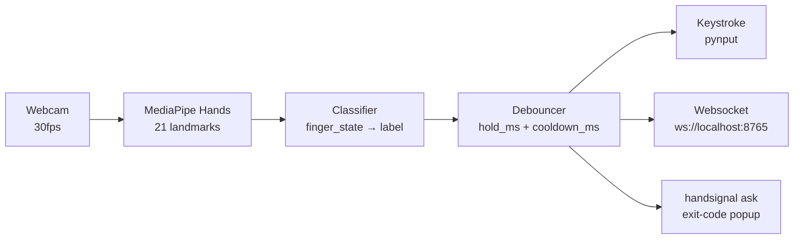

# hand-signal

[](LICENSE)
[](pyproject.toml)

**Hold a gesture in front of your webcam — agent gets a yes/no without you touching the keyboard. Six universal gestures, 21-landmark MediaPipe classifier, ~5% CPU at 30fps, entirely local.**

**Status:** v0.2 — `handsignal ask` ships a focused, always-on-top confirmation popup (👍 / 👎 / ✊) that exits with a code any script can branch on. `handsignal listen` streams gestures to keystrokes or a websocket continuously. macOS primary, Linux best-effort.

**Live demo:** [casterlygit.github.io/hand-signal](https://casterlygit.github.io/hand-signal/)

---

## Signal

- **~5% CPU** on a 2020-era MBP at 30fps (MediaPipe CPU-only pipeline, no GPU required)
- **21 3D landmarks per hand** at sub-100ms end-to-end latency
- **400ms hold threshold** + 1s cooldown — no double-fires, no transient triggers
- **6 gestures** classified with pure geometry (no learned weights, no camera-dependent training data)
- Zero cloud, zero API key, zero telemetry

---

## Why this exists

When you're coding *with* an agent (Claude Code, curby, anything), the agent stops every few minutes to ask: *"Continue? Approve this shell command? Run the migration?"* Voice is great for prompts but awkward for yes/no in public. Clicking breaks flow.

hand-signal watches your webcam for a small vocabulary of **universal hand signals** and turns them into keystrokes (or websocket events). Hold the gesture for ~400ms, agent gets your answer. No new vocabulary to memorize — your thumbs-up means what you'd expect.

Companion to [laptop-dictation](https://github.com/CasterlyGit/laptop-dictation) (voice in) and [curby](https://github.com/CasterlyGit/curby) (agent dispatcher).

---

## Architecture



All on-device. No cloud, no API key, ~5% CPU on a 2020-era MBP at 30fps.

---

## The six gestures

| Gesture | Default action | Shape |
|---|---|---|
| ✓ **tick** (peace / V) | `Enter` | index + middle extended, others curled |
| ✗ **cross** (rock / 🤘) | `Esc` | index + pinky extended |
| 👍 **thumbs_up** | `Enter` | fist + thumb up |
| 👎 **thumbs_down** | `n` | fist + thumb down |
| ✋ **open_palm** | `Ctrl+C` | all five fingers extended |
| ✊ **fist** | `Esc` | all fingers curled in |

All mappings are configurable. None fire on transient motion — a gesture must be held stable for `hold_ms` (default 400ms), then there is a `cooldown_ms` gap (default 1s) between any two fires.

---

## Setup

```bash
git clone https://github.com/CasterlyGit/hand-signal.git
cd hand-signal
./scripts/setup.sh      # creates .venv + installs deps + writes config

# macOS only: grant Camera + (optional) Accessibility permission
#   System Settings → Privacy & Security → Camera / Accessibility
#   Add: your terminal app (Terminal, iTerm, VSCode)

source .venv/bin/activate
handsignal doctor        # verify everything
handsignal listen        # start watching (print mode — no keystrokes yet)
```

When you're ready to wire it into Claude Code:

```bash
handsignal listen --keystrokes
```

Or flip `output.keystrokes_enabled = true` in `~/.config/hand-signal/config.toml`.

---

## Usage

### `handsignal ask` — focused confirmation popup (v0.2)

```bash
handsignal ask "Should Claude run: rm -rf node_modules?"
```

Opens a window with three big choices. Hold the gesture ~400ms; result flashes 1.5s; window closes. Exit codes:

| code | meaning | gesture |
|---|---|---|
| 0 | approve  | 👍 thumbs up |
| 1 | deny     | 👎 thumbs down |
| 2 | manual   | ✊ fist (user will handle it) |
| 3 | timeout  | — |
| 4 | quit / esc | — |

A drop-in shell wrapper lives at `scripts/claude-approve.sh` — use it from any Claude Code `PreToolUse` hook, CI gate, or by hand:

```bash
./scripts/claude-approve.sh "Push to main?" && git push origin main
```

### `handsignal listen` — always-on streaming daemon (v0.1)

```bash
# Print mode — see what's detected without affecting anything
handsignal listen

# Side-panel preview window with live event log
handsignal listen --preview

# Keystroke mode — gestures fire keystrokes into the focused window
handsignal listen --keystrokes

# Websocket mode — for curby / custom integrations
handsignal listen --websocket
# then: wscat -c ws://localhost:8765

# Show current config
handsignal config
```

---

## Config

`~/.config/hand-signal/config.toml`:

```toml
[camera]
index = 0
width = 640
height = 480
fps = 30

[detection]
hold_ms = 400              # gesture must be stable this long to fire
cooldown_ms = 1000         # min gap between fires
min_confidence = 0.7
min_tracking = 0.5
mirror = true              # selfie view

[output]
print_events = true
keystrokes_enabled = false
websocket_enabled = false
websocket_port = 8765

[output.keymap]
tick         = "enter"
cross        = "esc"
thumbs_up    = "enter"
thumbs_down  = "n"
open_palm    = "ctrl+c"
fist         = "esc"

[hotkey]
arm_key = ""               # empty = always on. Try "alt_r" for hold-to-arm.
```

---

## Wiring it to Claude Code

The simplest pattern: leave `keystrokes_enabled = true`. When Claude Code's permission prompt is focused, hold ✓ tick → Enter is pressed → approved. Hold ✗ cross → Esc → denied.

To scope it tighter (only when Claude window is active), use `arm_key = "alt_r"` so gestures only register while you're holding right-option.

---

## Hooking into curby

[curby](https://github.com/CasterlyGit/curby) is a voice-driven agent dispatcher with a status puck. The puck has a websocket client built in — point it at `ws://localhost:8765` and the puck animates when gestures fire.

Roadmap: render the last gesture as a tiny glyph in the puck corner.

---

## Used in

- **[CasterlyGit/realm](https://github.com/CasterlyGit/realm)** — a browser-based dragon-flight game where the same six-gesture vocabulary controls the dragon in real time. Hand position drives yaw + pitch; ✋ open palm flaps wings; ✊ closed fist breathes fire; ✌ peace sign casts a skill. Implemented browser-side with `@mediapipe/tasks-vision` and the same finger-extension classifier approach as this repo. [Live demo](https://casterlygit.github.io/realm/).

---

## Why MediaPipe?

- Runs entirely on CPU. Models ship with the package.
- 30fps on a 2020-era laptop with ~5% CPU.
- 21 3D landmarks per hand at sub-100ms latency end-to-end.
- Free, open, no rate limits, no network.

Alternatives considered:
- **OpenPose** — accurate but heavy (GPU recommended).
- **Apple Vision framework (`VNDetectHumanHandPoseRequest`)** — great on macOS but locks you out of Linux/Windows.
- **A custom-trained model** — too much effort for v0.1. Maybe v0.2 for air-drawn glyphs.

---

## Tests

```bash
source .venv/bin/activate
pytest
```

Tests cover the classifier (synthetic 21-landmark poses, no camera needed), config loading, and output backends (pynput / websockets mocked). The webcam loop itself is unit-tested via the classifier; an integration smoke test would require a controlled lighting rig.

---

## Roadmap

- [x] **v0.1** — `handsignal listen`: streaming daemon with keystroke + websocket output
- [x] **v0.2** — `handsignal ask`: focused confirmation popup with exit codes
- [ ] Wire `claude-approve.sh` into Claude Code `PreToolUse` hook for risky Bash patterns (`rm -rf`, `git push --force`, `curl | sh`, etc.) — pending user trust
- [ ] Custom air-drawn glyphs (✓, →, ⟲, ⌫, personal sigil)
- [ ] curby puck integration — render last gesture in puck corner
- [ ] MCP server transport — Claude reads gesture state via MCP
- [ ] Per-app keymaps
- [ ] Linux support — Wayland keystroke injection
- [ ] Streaming gesture preview tuning UX

---

## Companion repos

- [laptop-dictation](https://github.com/CasterlyGit/laptop-dictation) — voice in
- [curby](https://github.com/CasterlyGit/curby) — agent dispatcher
- [curby-jarvis](https://github.com/CasterlyGit/curby-jarvis) — voice + gesture macOS controller

---

## License

[MIT](LICENSE) — Copyright (c) 2026 Tarun (CasterlyGit)
